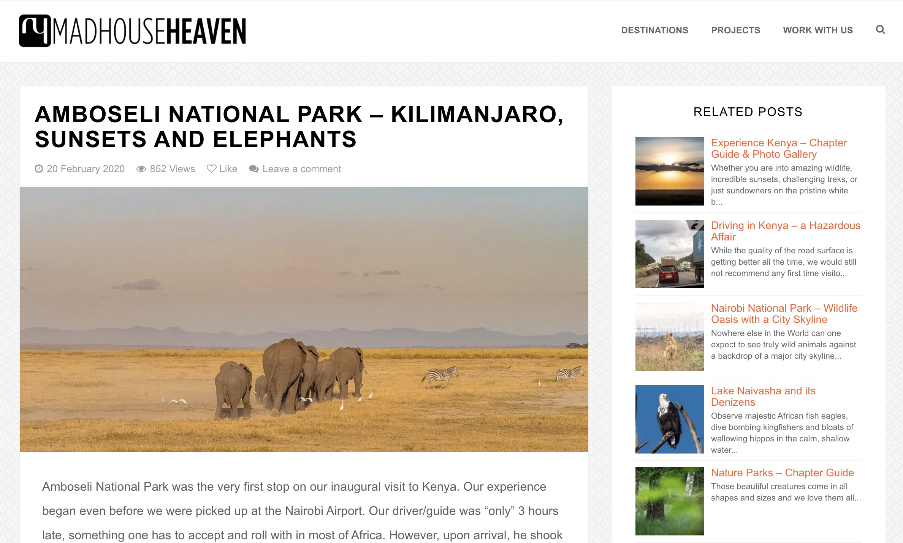

Madhouse Heaven is the professional website for a National Geographic award winning photographer. It is built on WordPress, and I have maintained it for the past 8 years.

Developing a Web App and a Web Site are two very different things. For this project, my focus was more on management and maintence of the site.

_A blog post page on Madhouse Heaven_

## My Responsibilities

- Technical SEO (e.g. structured data, permanent redirections, sitemaps, Google caching)
- Migration of site from BlueHost to SiteGround
- Hacking clean up
- Configuring backups
- Custom shortcodes
- Theme design updates
- Fixing plugin compatibility issues with PHP

## Tech Stack

- WordPress
- PHP
- CSS
