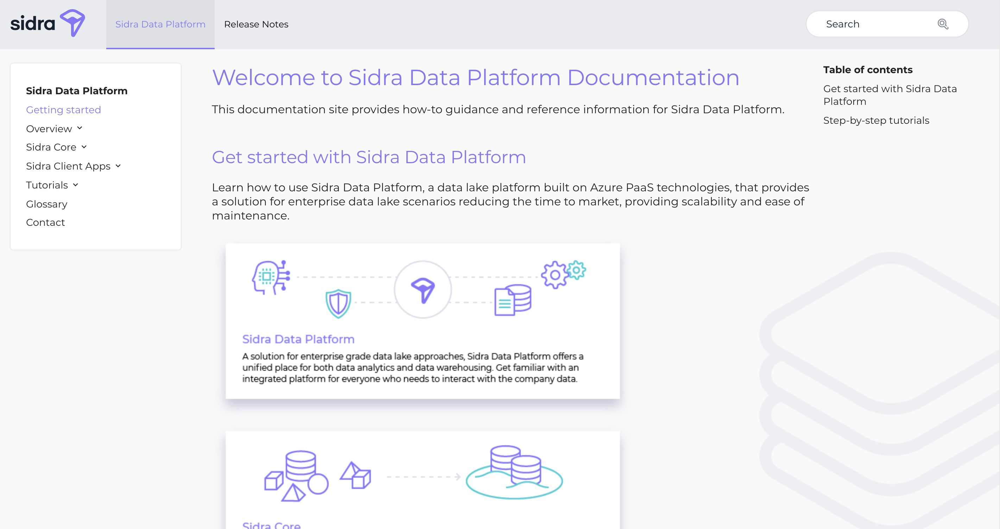

Sidra is a solution for enterprise data-lake systems. Companies generate a massive
amount of data every second, and none of it goes to waste. It is stored, tracked and
mined for information. Sidra proves a way to store this information in a transparent
manner so it can be accessed, tracked, analysed and understood.

This this end, the Sidra management UI enables users to view their data in a way
that makes key information easily available. It also enables users to edit meta-data
so that the information can be understood by other humans. It displays
details like server location, connections between providers and entities, advanced
filtering and real time notifications. Check out its capabilities in the [Sidra Docs](https://docs.sidra.dev/).

[_The sidra documentation page_](https://docs.sidra.dev/)

## Tech Stack

- React
- TypeScript
- MobX
- SCSS

## My Responsibilities

The user dashboard had to display a large variety of data. It also had filtration capabilities,
and the ability to edit information relating to the stored data. Some things I worked on:

- Dynamic grid with variable columns
- Modal for filtering entities and providers
- Live edit component for entities
- Page for notifications
- Map showing server locations

When I started on this project, there was a lot of legacy code. There were many bugs due to
changing specs over time and a lot of technical debt. I was also responsible for fixing these
bugs and refactoring code to make components more reusable.
