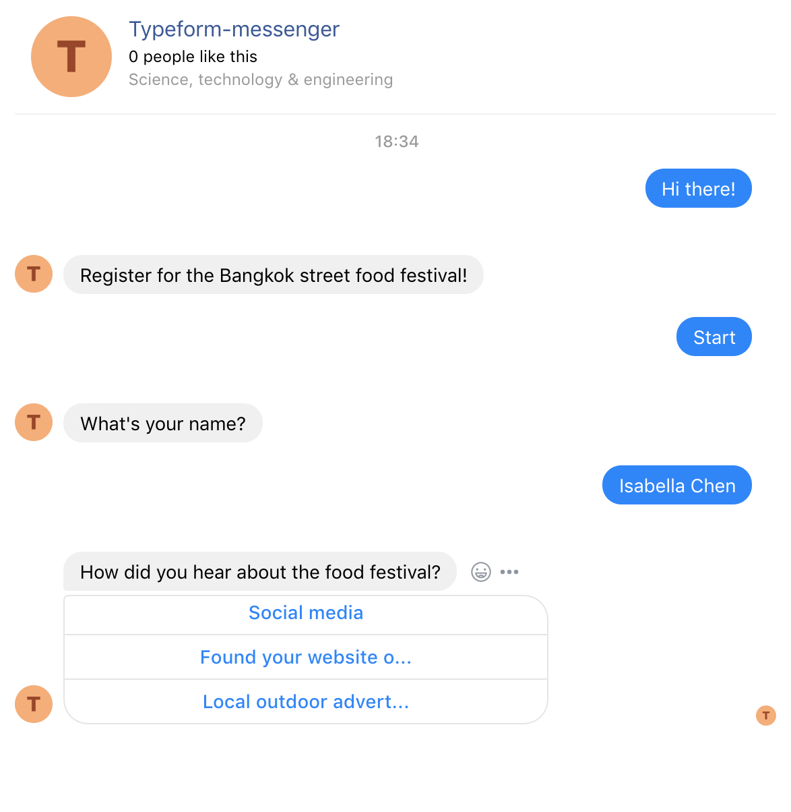
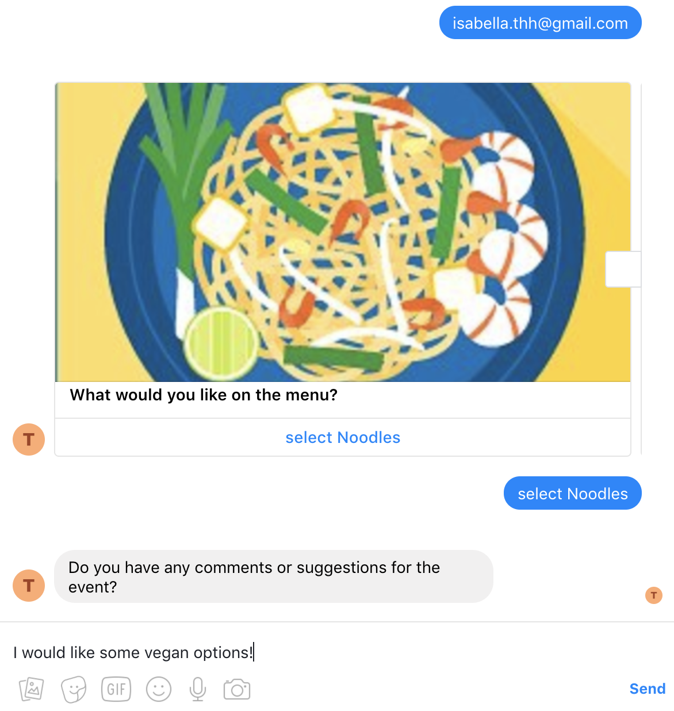
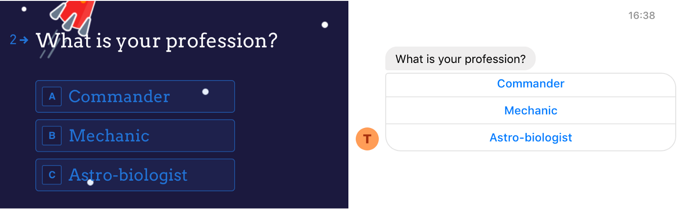

Data collection in developing countries is always challenging. How does one reach out to a large and unfamiliar demographic through the right channels with the right incentives to get enough responses? More importantly, how can an international NGO equip staff in their field offices, who have the social expertise but not the technical capacity, with the right technology to conduct such surveys?

---

## Tech Stack

- NodeJS
- Facebook API
- Typeform API
- Jest

---

## The Idea

The idea is simple. Give non-developers the power to create their own bots using Typeform and let the software take care of the rest. With Typeform, a field worker can easily create a form with all the questions she'd like to ask in a simple, intuitive way. She can then plug the typeform into our server, tell us where her Facebook bot lives and voilá! Her Facebook bot is set up to ask questions to anyone who visits her page on Facebook.

|            Screen One             |            Screen Two             |
| :-------------------------------: | :-------------------------------: |
|  |  |

## Translating Typeform’s API for Facebook Messenger

Typeform has a simple, elegant API, which means I could get to the meat of the problem pretty quickly — translating Typeform questions into responses for the Facebook bot to post to my users. The forms had more question types than could be directly translated to the Facebook Messenger Platform. It was tricky, trying to translate the richness of the Typeform form experience to Facebook chat. This was in no part a failing of the Messenger Platform of course, Facebook Messenger is, after all meant mainly for interaction via chat and not forms.

_Typeform(left) vs Facebook Messenger (right)_

Typeform can encode 21 different types of questions. Users can select from dropdowns, give ratings, provide feedback using an opinion scale, make a choice based on a picture — it goes on. Facebook, meanwhile, has three primary ways to interact with the user: with chat, buttons or quick replies, which allows the user to send quick yes/no answers or provide the bot with things like their location and email address.

Some question types could be converted in an obvious way, for example, a Typeform yes-no question type could be translated directly to a quick reply, while a dropdown became a row of buttons stacked on top of each other. Others were less straightforward. Star ratings and opinion scales ended up boiling down to the same thing due to screen real estate on Facebook Messenger — while there was no direct way to standardise a question asking for date input without throwing up a webview.

Nevertheless, all the question types, from multiple choice questions to questions that asked for personal details and long form answers, eventually found a counterpart representation on Facebook Messenger.
